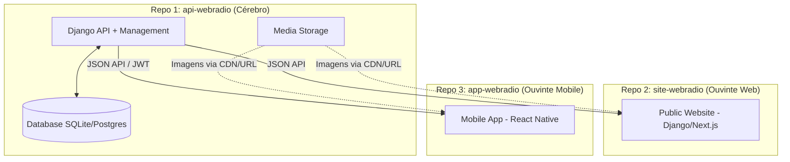

# Arquitetura do Sistema WebRádio

Esta documentação descreve a arquitetura do ecossistema WebRádio, onde o repositório atual (**API Webradio**) atua como o "Cérebro Central" do projeto.

## Estratégia de Multi-Repositórios

O ecossistema é dividido em três repositórios independentes para garantir a máxima segurança, escalabilidade e isolamento de deploys:

1.  **Back-end & Gestão (`api-webradio` - Este Repositório)**: Atua como o "Cérebro Central". Gerencia o banco de dados, oferece o Painel Administrativo privado e expõe a API REST protegida por JWT.
2.  **Front-end Web (`site-webradio`)**: Repositório dedicado ao site público. Consome os dados da API para exibir notícias, programação e player ao vivo. Pode ser implementado em Django (SSR) ou Next.js.
3.  **App Mobile (`app-webradio`)**: Repositório focado no aplicativo Android/iOS (React Native). Consome a API de forma assíncrona para interatividade.

---

## Componentes Técnicos

### 1. Camada de Gerenciamento (`webadmin`)
Implementada em Django puro com TailwindCSS para performance e estética premium. Esta camada é responsável por:
- **Dashboard**: Visão geral de métricas, pedidos e notícias em tempo real.
- **Formulários Ricos**: Cadastro de notícias com múltiplos uploads e gestão inteligente de dias da semana (M2M) na programação.
- **Integração com Modo Escuro**: Suporte estético completo no painel via Tailwind CSS.
- **Autenticação de Sessão**: Protege o acesso de gestores à interface visual de alta fidelidade.

### 2. Camada de API (`DRF`)
Utiliza o Django Rest Framework para expor os dados aos satélites (App/Site):
- **Notícias**: Endpoint `/api/noticias/` (com suporte a paginação e galeria).
- **Patrocinadores**: Endpoints segmentados para Site e App.
- **Interativida**: Endpoint `/api/pedidos/` aberto ao público para envio de pedidos de música.
- **Segurança**: Integração com **Simple JWT** para autenticação via token quando necessário.

### 3. Satélites (Externos)
- **App Mobile**: Desenvolvido em React Native, acessa os endpoints para a grade de programação, lista de equipe e envio de pedidos.
- **Site**: Geralmente focado no consumo de notícias e banners de patrocinadores.

---

## Fluxo de Mídia
As imagens (Notícias, Equipe, Patrocinadores) são armazenadas no diretório `/media/` e servidas diretamente via URL. A API retorna o caminho absoluto da imagem, permitindo que o App Mobile (React Native) renderize utilizando componentes padrão de `Image`.

## Escalabilidade
A arquitetura foi projetada para que o banco de dados possa ser facilmente migrado de SQLite para **Postgres** em ambiente de produção, e o armazenamento de mídia para um serviço como **AWS S3** ou **Azure Blob Storage** sem a necessidade de reescrever a lógica da API.

---
Voltar para o [README](../README.md).
